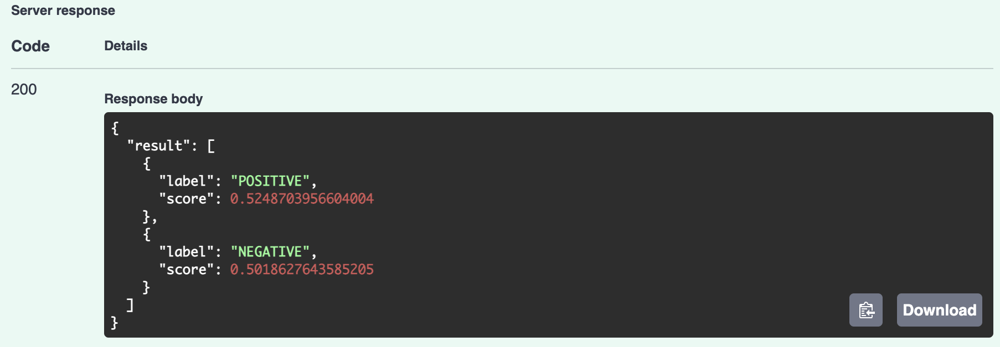

# Model Serving of a Sentiment Analysis Model
In this repo, I deployed a Tesla sentiment analysis model to a SAM via AWS Lambda. This was a homework assignment for the FourthBrain MLE 
course.

## Task 1: Build and Test Locally via CAM CLI

First we build the application with SAM. This can take several minutes to complete.

`sam build`

To test that it worked, we can try a single function.

`sam local invoke SentimentFunction --event events/event.json`

## Task 2: Deploy on AWS

My user credentials and access requirements were set up for the course before this assignment. We start here by setting them as environment 
variables. Note that the true access key id and key would be used.

```
export AWS_ACCESS_KEY_ID=your_access_key_id
export AWS_SECRET_ACCESS_KEY=your_secret_access_key
```

I used the guided deployment command. I named my app `teslabot` and selected `us-east-1`. For this project it is acceptable and appropriate to 
select 'y' to all of the other prompts, and to use the default output file names.

`sam deploy --guided`

After the data is loaded to the cloud, we can see that it was successful when the API Gateway Endpoint URL is shown.


## Task 3: Test the API endpoint

I opened my browser and went to the URL above with /docs appended to the end. This opens the API documentation and allows us to test the API 
endpoint. I clicked the "Try it out" button and input text into the request body.


The API response is shown below. Sentiment scores are returned for the input comments.



Note that we can use the command `sam logs` to fetch logs for review and troubleshooting. This command works for all AWS Lambda functions, not just 
those deployed via SAM. I used the command below.

`sam logs --stack-name teslabot --tail --region us-east-1`

Additionally, we can delete our app using the command below.

`sam delete --stackname teslabot --region us-east-1`

